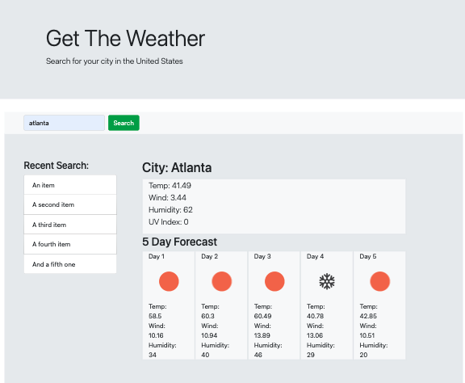

# 06-weather-dashboard
This is a weather dashboard that connects with an API  to return data for certain cities based on user entries.
* enter a city to search weather in your location
* returns current weather + next 5 days
* review recent searches
* UV index safety 

# Preview

# Links
Link:  https://amywilhoite.github.io/06-weather-dashboard/  
Repository: https://github.com/AmyWilhoite/06-weather-dashboard.git 

